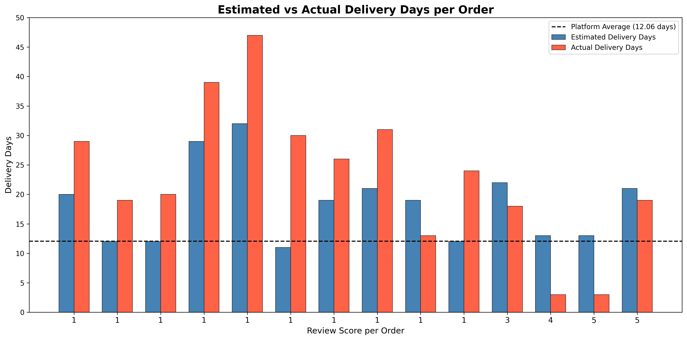
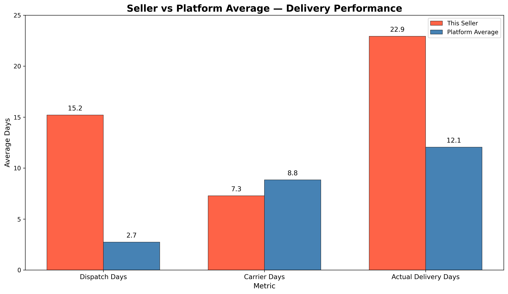
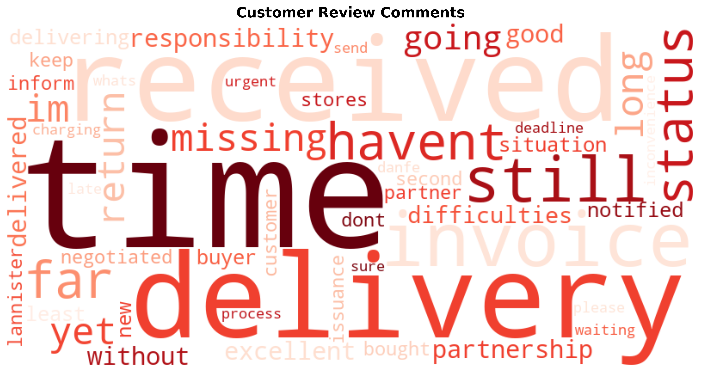

# 🛡️ OLIST Seller Removal Defence Analytics

> A data-driven investigation challenging a seller removal decision on the Olist
> e-commerce platform — uncovering dispatch delays, not product quality,
> as the true root cause of low customer ratings.

---

## 📁 Project Files

Full project files including SQL scripts, Python Jupyter notebook, charts, and documentation are available here:

**[📂 Google Drive — Project Folder](https://drive.google.com/drive/folders/18jmziDn28voxKRFz1ipN2w72HsvxqMe2?usp=sharing)**

---

## 🧩 Business Problem

The leadership at Olist had decided to remove sellers with an average rating of 2 and below out of 5 — provided the seller had completed a minimum of 10 orders — citing that their products were bad.

As the Data Analyst, I challenged this decision and recommended a data-driven investigation be conducted to determine the true root cause of the low ratings — challenging the assumption that poor ratings reflect poor product quality.

**The central question:**

> *Are customers rating their overall experience — including logistics and delivery —*
> *rather than the product itself?*

---

## 🔍 Key Findings

### Finding 1 — The Seller Has a Statistically Significant Low Rating
10 out of 14 orders received a 1-star rating — a consistent pattern warranting investigation, not immediate removal.

| Metric | Value |
|---|---|
| Average Rating | 1.93 / 5.00 |
| Total Orders | 14 |
| Orders Rated 1 Star | 10 (71%) |
| Orders Rated 4–5 Stars | 3 (21%) |

---

### Finding 2 — Distance Is Not the Cause
Orders travelling as little as **5km, 9km, and 11km** received 1-star ratings, while orders travelling **331km and 417km** received ratings of 4 and 5 stars respectively. Distance has **no correlation** with low ratings.

---

### Finding 3 — The Carrier Is Not Responsible
The carrier delivery time for this seller was **8.00 days** — virtually identical to the platform average of **8.85 days**. The carrier performed normally.

| Metric | This Seller | Platform Average | Verdict |
|---|---|---|---|
| Carrier Delivery Days | 8.00 days | 8.85 days | ✅ Normal |

---

### Finding 4 — The Seller's Dispatch Time Is the Root Cause
The platform average dispatch time is **2.74 days**. This seller's late orders averaged **21.11 days** to dispatch — **7 times slower than the platform average.** All 9 late orders received a 1-star rating. Fast dispatch orders received 4 and 5 stars.

| Metric | This Seller (Late Orders) | Platform Average | Difference |
|---|---|---|---|
| Dispatch Days | 21.11 days | 2.74 days | 7.7× slower |
| Carrier Days | 8.00 days | 8.85 days | ✅ Normal |
| Actual Delivery Days | 29.44 days | 12.06 days | 2.4× longer |

---

### Finding 5 — Customers Complained About Delivery, Not Product Quality
Review comment analysis revealed dominant themes of delivery delays, missing orders, and status uncertainty. **No comments mentioned product quality, broken items, or wrong items.**

| Theme | Keywords Found |
|---|---|
| Delivery experience | delivery, received, receiving |
| Timing and lateness | time, long, late, deadline |
| Orders not arrived | status, missing, havent, still |
| Frustration | waiting, far, inconvenience |
| Non-delivery action | return |

---

## ✅ Recommendation

Do not remove the seller. Implement a **dispatch time improvement plan**:

- 📌 Set a maximum dispatch threshold of **3 days** — aligned with the platform average
- 📊 Monitor dispatch compliance **weekly for 90 days**
- 📋 Provide the seller with their performance data and platform benchmarks
- ⚠️ Issue a formal warning if dispatch exceeds **5 days** on any order
- 🔄 Review removal **only if** performance does not improve within 90 days

---

## 📊 Charts

### Estimated vs Actual Delivery Days per Order

### Seller vs Platform Average — Delivery Performance

### Customer Review Word Cloud — Low Rated Orders

---

## 🗂️ Project Structure
